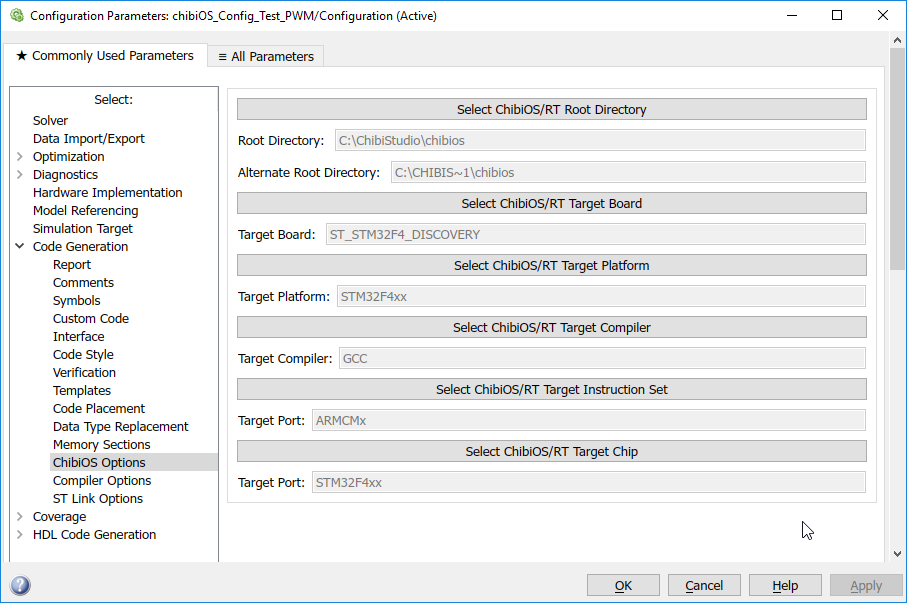

# ChibiOS SimulinkBlockset

Simulink blockset for ChibiOS for use on the STM32F4-Discovery boards.

- [ChibiOS](http://www.chibios.org/dokuwiki/doku.php)
- [STM32F4-Discovery](https://www.st.com/en/evaluation-tools/stm32f4discovery.html)

Features:

- Flash directly from Simulink
- Compile directly from Simulink

## Images

### ChibiOS Configuration Block:

### HAL Configuration

HAL: 

PWM Config:

Example PWM Model:

### Simulink Embeded Coder Options

Compiler Config:

STLink config (for flashing):

## Usage

Documentation available upon request.
